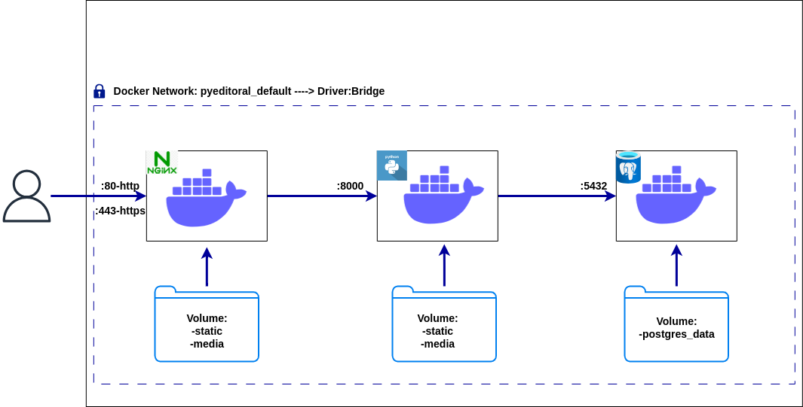
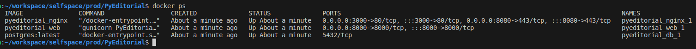

<h2>PyEditoral,open-source Blog CMS</h2>

- This project was forked from mavenium/PyEditorial.

- **In addition to the project, postgresql, gunicorn and nginx were added. The existing dockerfile and docker-compose.yml are more automated with improved .sh scripts. In addition, minimum intervention to the source code is aimed with .env files. You can check my commits for all and more.**
------------------------------------------------------------

<h2> Workflow </h2>

<h2>PREREQUISITES</h2>

- Ubuntu 22.04 was used in the project. Therefore it is required
- Docker(Current:25.0.4), docker-compose(Current:1.29.2)
- git

<h2>HOW to USE</h2>

### After meeting the prerequisites;

- Pull the project on your local with **"git pull https://github.com/agcaekrem/PyEditorial.git"** and then navigate to the project directory.

- Then run the script with the command **./runtime.sh**, if you get a permission error please run the command; **chmod +x ./runtime.sh**

- This is enough to run the project. After running, let's check our containers with the **docker ps command**. You should see an output like this;

-  You can use the project by going to https://localhost:8080 or http:localhost

<h3>To create an admin user;</h3>

- Access the container interactively using **docker exec -it pyeditoral_web_1 bash** and then create an admin user by typing **./manage.py createsuperuser** .
Then go to **https://localhost:8080/admin** and log in.

#### &#x1F389;&#x1F389;&#x1F389; Have a fun ! &#x1F389;&#x1F389;&#x1F389;